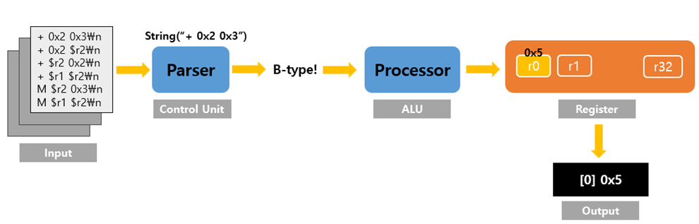
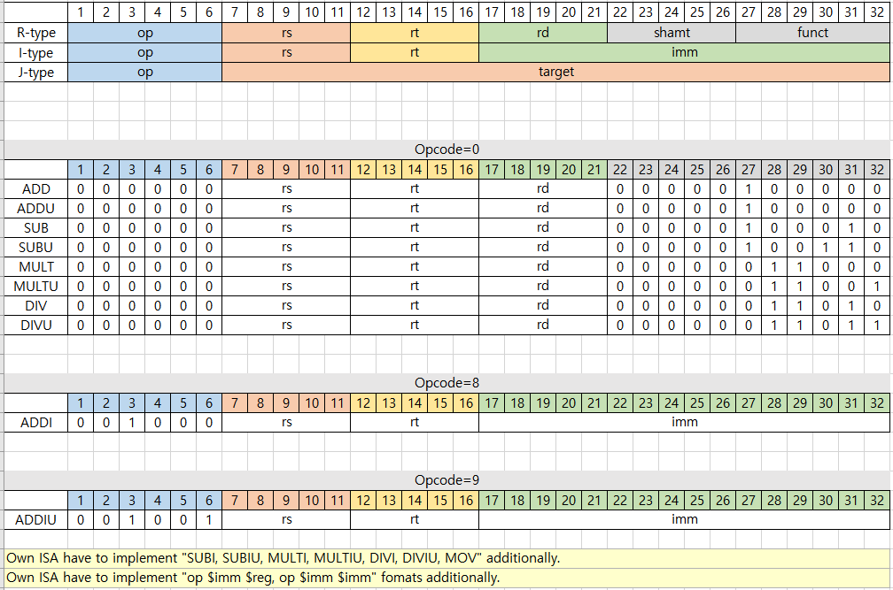
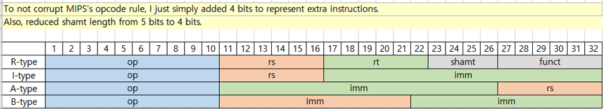
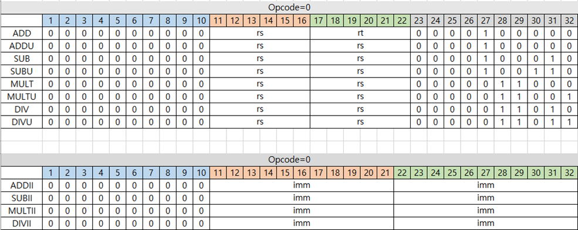
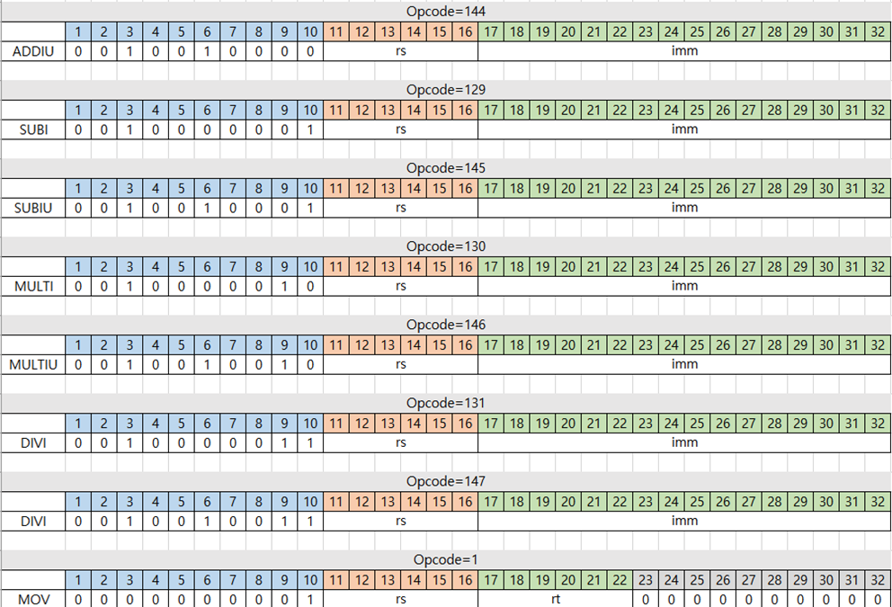
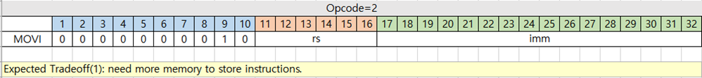

# simple-calculator
<<<<<<< HEAD

- Single-Cycle Design
- Imitated MIPS Architecture.

### Overall

---

### MIPS ISA

---

### My Own ISA Formats

=======
execute arithmetic operation
>>>>>>> d04f0d1c4d3f99e394f2f6a7257df42fc8665b56
